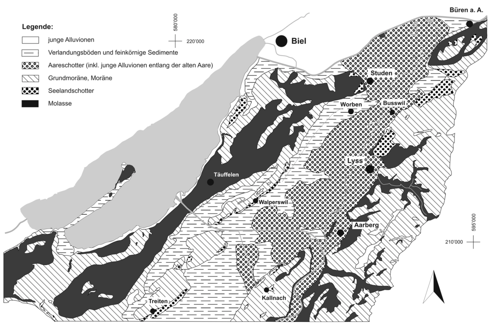

# Introduction {#intro}

## Hydrogeology of the Seeland aquifer
The Seeland aquifer has been formed after the last ice age from lake and river deposits. It extends from Kallnach in the south to B\"uren in the north with the  

```{r hydrogeology-seeland, echo=FALSE, fig.show = "hold", out.width='100%',fig.cap='Hydrogeology of the Seeland aquifer. Figure source: @WasserwirtschaftsamtdesKantonsBern2004. Translation of the legend: junge Alluviolen: young alluvial soils, Verlandungsböden und feinkörnige Sedimente: fine alluvial sediments, Aareschotter (inkl. junge Alluvionen entlang der alten Aare): Aareschotter (coarse alluvial sediments), Grundmoräne, Moräne: moraine material, Seelandschotter: Seelandschotter (coarse sediments), Molasse, molasse'}


```

The highest transmissivities of the aquifer are between Kallnach and Lyss [@WasserwirtschaftsamtdesKantonsBern2004]. The IfU groundwater monitoring site lies in a forest between Kappelen and Lyss next to the river Alte Aare (Figure \@ref(fig:map-overview)) where the Aareschotter reaches a thickness of 30m approximately. The research site was established in the late 90ies as a site to research microbial communities in groundwater with high dissolved organic content [@Kennedy2001].  
  
## The Kappelen monitoring site
Figure \@ref(fig:map-overview) shows a map with the locations of the IfU monitoring locations.   

```{r map-overview, out.width='100%', echo=FALSE, message=FALSE, error=FALSE, waring=FALSE, fig.cap='Kappelen site overview. Blue points indicate groundwater monitoring stations, yellow points indicate soil monitoring stations and the green point indicates the pressure sensor in the river Alte Aare.'}

# Load coordinates of measurement sites
coord <- readxl::read_xlsx('_bookdown_files/data/coordinates_Kappelen.xlsx',
                           skip = 2)

marker_colour <- colorFactor(palette = c('blue','green','yellow','yellow'), 
                             domain = coord$Type)

leaflet() %>% 
  addProviderTiles('Esri.WorldImagery') %>%
  addProviderTiles("CartoDB.PositronOnlyLabels") %>%
  setView(mean(coord$`Easting [°]`), mean(coord$`Northing [°]`), zoom = 15) %>%
  addCircleMarkers(lng=coord$`Easting [°]`, lat=coord$`Northing [°]`, 
             label=coord$`Site Name`, radius=4, stroke=FALSE,
             fillColor=marker_colour(coord$Type), fillOpacity=0.8)
  
```

In Kappelen we measure groundwater pressure continuously in 11 boreholes. 6 of the installed sensores, namely 2.1, 3.2, 4.1, 6.1, 6.2, 7.2, measure temperature and electrical conductivity in addition to pressure. A pressure sensor measured changes of river water level in the Alte Aare upstream of the groundwater monitoring site. In two locations, under grass and forest, soil moisture, matric potential and soil temperature are measured. Weather data is collected on grass land close to the groundwater monitoring site.    
The coordinates of the measurement sites and a list of parameters that are mearued at each site can be downloaded [here](https://github.com/mabesa/Documentation_GW_field_course_2020/blob/master/_bookdown_files/data/coordinates_Kappelen.xlsx)

At the Kappelen site, the aquifer consists of a highly permeable upper aquifer layer and a lower aquifer layer which is partially separated from the uppder aquifer  by a semi-permeable layer. At 7 locations, two piezometers have been installed in the shallow and in the deep aquifer each with filtered depths between approximately 5m and 8m and between approximately 10m and 15m. The two different types of boreholes present in Kappelen are shown schematically in Figure \@ref(fig:borehole-schematic). 

```{r borehole-schematic, out.width='80%', echo=FALSE, message=FALSE, error=FALSE, waring=FALSE, fig.cap='Schematic of boreholes in the shallow and deep aquifer layer. Following common practice in hydrogeology, the boreholes are labeled in ascending order with the boreholes reaching to the oldest geological layers having the lowest suffix numbers.'}
knitr::include_graphics("_bookdown_files/figure-html/borehole_types.png")
```

