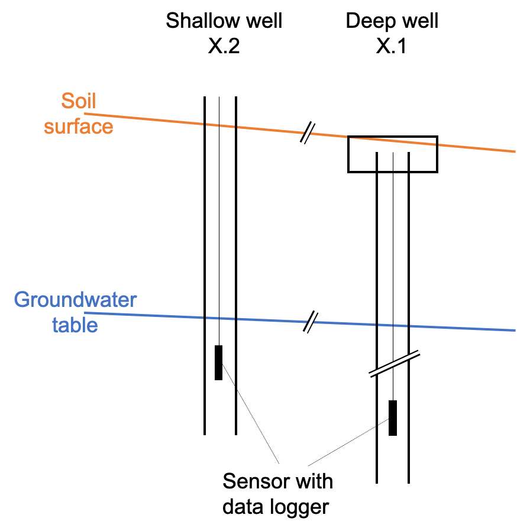

# Introduction {#intro}

## Hydrogeology of the Seeland aquifer

## The Kappelen monitoring site
Figure \@ref(fig:map-overview) shows a map with the locations of the IfU monitoring locations.   

```{r map-overview, out.width='100%', echo=FALSE, message=FALSE, error=FALSE, waring=FALSE, fig.cap='Kappelen site overview. Blue points indicate groundwater monitoring stations, yellow points indicate soil monitoring stations and the green point indicates the pressure sensor in the river Alte Aare.'}

# Load coordinates of measurement sites
coord <- readxl::read_xlsx('_bookdown_files/data/coordinates_Kappelen.xlsx',
                           skip = 2)

marker_colour <- colorFactor(palette = c('blue','green','yellow','yellow'), 
                             domain = coord$Type)

leaflet() %>% 
  addProviderTiles('Esri.WorldImagery') %>%
  addProviderTiles("CartoDB.PositronOnlyLabels") %>%
  setView(mean(coord$`Easting [°]`), mean(coord$`Northing [°]`), zoom = 15) %>%
  addCircleMarkers(lng=coord$`Easting [°]`, lat=coord$`Northing [°]`, 
             label=coord$`Site Name`, radius=4, stroke=FALSE,
             fillColor=marker_colour(coord$Type), fillOpacity=0.8)
  
```

The two different types of boreholes present in Kappelen are shown schematically in Figure \@ref(fig:borehole-schematic). 

```{r borehole-schematic, out.width='80%', echo=FALSE, message=FALSE, error=FALSE, waring=FALSE, fig.cap='Schematic of boreholes in the shallow and deep aquifer layer. Following common practice in hydrogeology, the boreholes are labeled in ascending order with the boreholes reaching to the oldest geological layers having the lowest suffix numbers.'}

```

