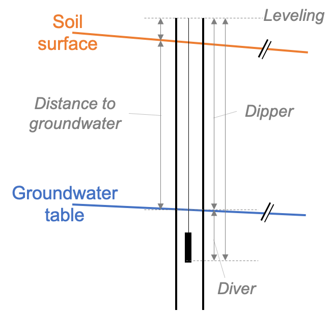

# Groundwater levels & dynamics 

## Measure distance to groundwater and interpolate groundwater table
The pressure signal of groundwater is one of the post important parameters to derive groundwater state and dynamics from. There are two methods which are typically used to measure groundwater pressure: (1) Distance from the well casing to the groundwater table with a dipper and (2) absolute groundwater pressure. In Kappelen, we measure both. 

### Measurements of distance to groundwater
Distance to groundwater is measured with a dipper. Thereby, a weight attached to a measuring tape is lowered to the groundwater table. Low-cost, low-tech analogue dippers are widely used around the world but there are also electrical variants that give a light and/or sound signal when the dipper reachis the water table in the borehole (Figure \@ref(fig:measurement-dipper)).

```{r measurement-dipper, out.width='60%', echo=FALSE, message=FALSE, error=FALSE, waring=FALSE, fig.cap='Schematic of boreholes in the shallow and deep aquifer layer.'}
knitr::include_graphics("_bookdown_files/figure-html/measurement_dipper.jpg")
```

Dippers measure the distance from the rim of the borehole pipe to the water level in the borehole. In order to compute distance from the soil surface to the groundwater level, the distance between the rim of the borehole and the soil surface needs to be subtracted. In order to obtain the altitude of the groundwater table, the altitude of the rim of the borehole needs to be known and the distance to the groundwater subtracted (Figure \@ref(fig:from-dipper-to-GW-level)).  

```{r from-dipper-to-GW-level, out.width='60%', echo=FALSE, message=FALSE, error=FALSE, waring=FALSE, fig.cap='Schematic of the length measurements taken around a borehole to derive groundwater table.'}

```

Measurements of distance to groundwater measured by students during the groundwater field course in June 2019 are presented in 

```{r}
# Read in depth to groundwater table
dGW <- readxl::read_xlsx('_bookdown_files/data/depth_to_groundwater.xlsx')

knitr::kable(
  dGW %>% select(-`Sensor cable length [m]`), booktabs = TRUE,
  caption = 'Distance to groundwater measured by 4 different student groups.'
)
```

#### Task 1: Estimate the accuracy of the measurement of distance to groundwater based on the data above.  
Help: The data is available on [github](https://github.com/mabesa/Documentation_GW_field_course_2020/blob/master/_bookdown_files/data/depth_to_groundwater.xlsx) (press "download" or "view raw" and an excel document is downloaded to your computer). 

#### Task 2: Calculate the groundwater level
Help: The altitude of the rims of the well casings are available on [github](https://github.com/mabesa/Documentation_GW_field_course_2020/blob/master/_bookdown_files/data/coordinates_Kappelen.xlsx) (press "download" or "view raw" and an excel document is downloaded to your computer). The altitude of the borehole casings is accurate down to approximately 0.5cm. 

#### Task 3: Draw a piezometric map of groundwater levels in Kappelen 
Help: Perform a Kriging interpolation seperately for the two aquifer layers. In R, the package gstat offers a *krige* routine [@Pebesma2004].  

### Measurement of absolute pressure
The development of the pressure signal in the groundwater is measured with pressure sensors. Commonly, the absolute pressure is measured, i.e. atmospheric pressure plus the pressure of the water column above the sensor. The atmospheric pressure has to be measured above the water table and subtracted from the absolute pressure. From the pressure of the water column above the sensor, a temperature dependent conversion to m of water column is done to derive the height of the water column above the pressure sensor.  
Finally, to obtain the groundwater level, the length of the sensor cable has to be known (Figure \@ref(fig:from-dipper-to-GW-level)). 

In Kappelen, groundwater pressure is monitored continuously in 11 Piezometers, of which 6 sensors send hourly data to the cloud. Figure \@ref(fig:groundwater-level-timeseries) shows the measured groundwater levels in the 6 on-line sensors over time. 
```{r groundwater-level-timeseries, out.width='80%', echo=TRUE, message=FALSE, error=FALSE, waring=FALSE, fig.cap='Time series of groundwater levels in the 6 on-line monitoring stations.'}
# Read groundwater pressure data from file
P_pressure <- read.csv2('_bookdown_files/data/groundwater_pressure_mbar.csv')
# Convert Time column to R-readable datetime format 
P_pressure$Time <- as.POSIXct(P_pressure$Time, format='%Y-%m-%dT%H:%M:%S', tz='UTC')
# Make sure pressure is a numeric value
P_pressure$Value <- as.numeric(P_pressure$Value)

# Read atmospheric pressure from file
W_airPressure <- read.csv2('_bookdown_files/data/weather_station_airPressure_kPa.csv')
# Convert Time column to R-readable datetime format 
W_airPressure$Time <- as.POSIXct(W_airPressure$Time, format='%Y-%m-%dT%H:%M:%S', tz='UTC')
# Make sure pressure is a numeric value
W_airPressure$Value <- as.numeric(W_airPressure$Value) * 10  # from kPa to mbar

# Aggregate data to daily values
P_pressure_daily <- P_pressure %>%
  mutate(Day = floor_date(Time, unit='days')) %>%
  group_by(Series, Day) %>%
  summarise(Time = first(Day),
            Pressure_mbar = mean(Value, na.rm=TRUE))

W_airPressure_daily <- W_airPressure %>%
  mutate(Day = floor_date(Time, unit='days')) %>%
  group_by(Series, Day) %>%
  summarise(Time = first(Day),
            AirPressure_mbar = mean(Value, na.rm=TRUE))

# Calculate pressure of water column above sensor
P_pressure_daily <- left_join(P_pressure_daily, W_airPressure_daily %>%
                                select(Day,AirPressure_mbar), 
                              by='Day') %>%
  select(-Series.y) %>%
  drop_na() %>%
  mutate(PressureWC_mbar = Pressure_mbar - AirPressure_mbar,
         PressureWC_m = PressureWC_mbar/100)  # Rule of thumb: 1bar is approximately 10 m water column

# Filter outliers
P_pressure_daily$PressureWC_m[P_pressure_daily$PressureWC_m > 10] <- NA
P_pressure_daily$PressureWC_m[P_pressure_daily$PressureWC_m < 0.8] <- NA

# Calculate altitude of groundwater level
P_altitude <- left_join(P_pressure_daily %>%
                          drop_na() %>%
                          mutate(Well=substr(Series.x, 
                                             nchar(Series.x)-3+1, 
                                             nchar(Series.x))), 
                        dGW %>%
                          select(Well, `Sensor cable length [m]`) %>%
                          mutate(Well=as.character(Well)),
                        by='Well') %>%
  left_join(., coord %>%
              mutate(Well=substr(`Site Name`, nchar(`Site Name`)-3+1,
                                 nchar(`Site Name`))),# %>%
#              select(`Elevation m a.s.l.`,Well),
            by='Well') %>%
  mutate(GWlevel_masl=`Elevation m a.s.l.` - 
           `Sensor cable length [m]` + PressureWC_m,
         Layer=ifelse(sub('.*(?=.$)', '', Well, perl=T)=='1','1','2'))
  
P_altitude %>% 
  dplyr::filter(Parameters=='P, T, EC') %>%
  ggplot() + 
  geom_point(aes(x=Day, y=GWlevel_masl, col=Layer, shape=Well), 
             size=0.8) + 
  theme_bw() + 
  labs(y='Groundwater level [m a.s.l.]') + 
  scale_color_viridis_d()
```
Figure \@ref(fig:groundwater-level-timeseries). 

#### Task 4:


### Discussion


## Temporal evolution of groundater table

<!--## Temporal evolution of groundwater temperature-->

<!--## Temporal evolution of groundwater electrical conductivity-->
