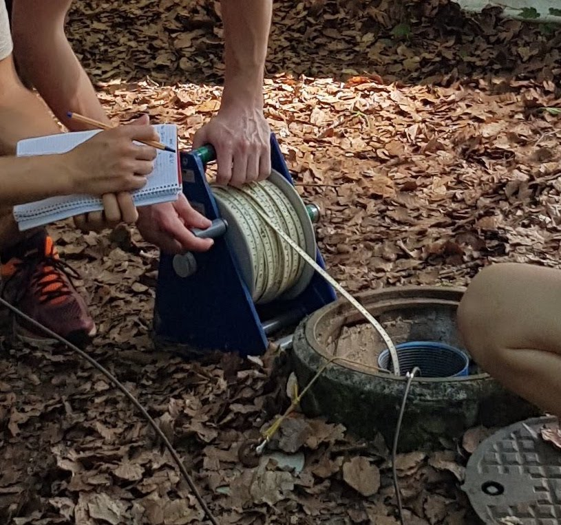

# Groundwater levels & dynamics 

## Measure distance to groundwater and interpolate groundwater table
The pressure signal of groundwater is one of the post important parameters to derive groundwater state and dynamics from. There are two methods which are typically used to measure groundwater pressure: (1) Distance from the well casing to the groundwater table with a dipper and (2) absolute groundwater pressure. In Kappelen, we measure both. 

### Measurements of distance to groundwater
Distance to groundwater is measured with a dipper. Thereby, a weight attached to a measuring tape is lowered to the groundwater table. Low-cost, low-tech analogue dippers are widely used around the world but there are also electrical variants that give a light and/or sound signal when the dipper reachis the water table in the borehole (Figure \@ref(fig:measurement-dipper)).

```{r measurement-dipper, out.width='80%', echo=FALSE, message=FALSE, error=FALSE, waring=FALSE, fig.cap='Schematic of boreholes in the shallow and deep aquifer layer.'}

```

Dippers measure the distance from the rim of the borehole pipe to the water level in the borehole. In order to compute distance from the soil surface to the groundwater level, the distance between the rim of the borehole and the soil surface needs to be subtracted. In order to obtain the altitude of the groundwater table, the altitude of the rim of the borehole needs to be known and the distance to the groundwater subtracted (Figure \@ref(fig:from-dipper-to-GW-level)).  

Measurements of distance to groundwater measured by students during the groundwater field course in June 2019 are presented in 

```{r}
# Read in depth to groundwater table
dGW <- readxl::read_xlsx('_bookdown_files/data/depth_to_groundwater.xlsx')

knitr::kable(
  dGW %>% select(-`Sensor cable length [m]`), booktabs = TRUE,
  caption = 'Distance to groundwater measured by 4 different student groups.'
)
```


### Measurement of absolute pressure
The development of the pressure signal in the groundwater is measured with pressure sensors. Commonly, the absolute pressure is measured, i.e. atmospheric pressure plus the pressure of the water column above the sensor. The atmospheric pressure has to be measured above the water table and subtracted from the absolute pressure. From the pressure of the water column above the sensor, a temperature dependent conversion to m of water column is done to derive the height of the water column above the pressure sensor.  
Finally, to obtain the groundwater level, the length of the sensor cable has to be known (Figure \@ref(fig:from-dipper-to-GW-level)). 

```{r from-dipper-to-GW-level, out.width='80%', echo=FALSE, message=FALSE, error=FALSE, waring=FALSE, fig.cap='Schematic of the length measurements taken around a borehole to derive groundwater table.'}
knitr::include_graphics("_bookdown_files/figure-html/from_dipper_to_gw_level.png")
```

Many steps are involved in obtaining groundwater level measurements and, consequently, many uncertainties accumulate. 


## Temporal evolution of groundater table

<!--## Temporal evolution of groundwater temperature-->

<!--## Temporal evolution of groundwater electrical conductivity-->
