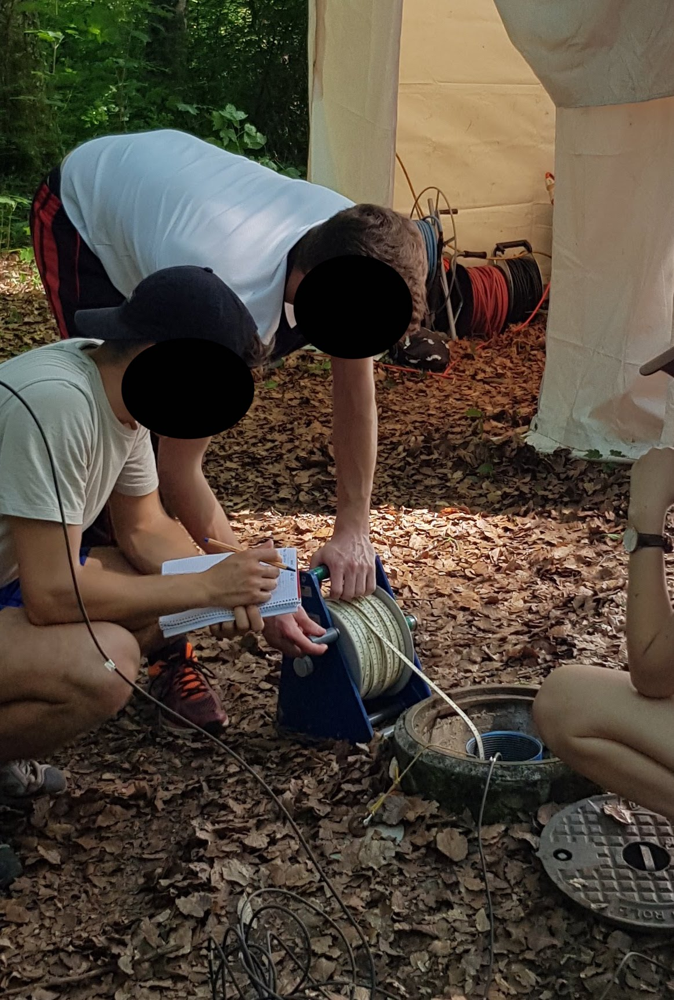
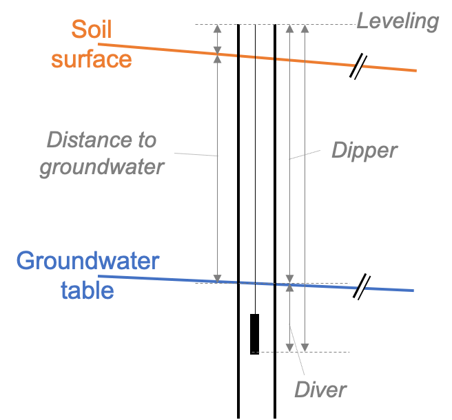

# Groundwater levels & dynamics 

## The piezometric map & time series data
A piezometric map (also called a map of hydro-isolines) describes groundwater state and sometimes even basic groundwater dynamics. It is derived from the pressure signal of groundwater. There are two methods which are typically used to monitor groundwater pressure: (1) Measurement of the distance from the well casing to the groundwater table with a dipper and (2) measurement of absolute groundwater pressure. In Kappelen, we measure both. 

### Measurement of distance to groundwater
Distance to groundwater is measured with a dipper. Thereby, a weight attached to a measuring tape is lowered to the groundwater table. Low-cost, low-tech analogue dippers are widely used around the world but there are also electrical variants that give a light and/or sound signal when the dipper reaches the water table in the borehole (Figure \@ref(fig:measurement-dipper)). Common to all dippers is the manual measurement, i.e. the method is suitable for low monitoring frequencies. 

```{r measurement-dipper, out.width='60%', echo=FALSE, message=FALSE, error=FALSE, waring=FALSE, fig.cap='Schematic of boreholes in the shallow and deep aquifer layer.'}

```

Dippers measure the distance from the rim of the borehole pipe to the water level in the borehole. In order to compute distance from the soil surface to the groundwater level, the distance between the rim of the borehole and the soil surface needs to be subtracted. In order to obtain the altitude of the groundwater table, the altitude of the rim of the borehole needs to be known and the distance to the groundwater subtracted (see Figure \@ref(fig:from-dipper-to-GW-level) for an illustration of the different measurements that need to be taken from a borehole in order to be able to compute absolute groundwater levels).  

```{r from-dipper-to-GW-level, out.width='60%', echo=FALSE, message=FALSE, error=FALSE, waring=FALSE, fig.cap='Schematic of the length measurements taken around a borehole to derive groundwater table. The rim of the borehole does generally not coincide with the groundwater level and needs to be leveled in. The distance to groundwater commonly refers to the distance between the soil surface and the water level measured in the borehole. With a manual dipper, the distance between the rim of the borehole and the groundwater level is measured. Finally, a diver pressure sensor measures the absolute pressure of water and air above the sensor opening and needs to be corrected with measurements of air pressure.'}

```

Measurements of distance to groundwater measured by students during the groundwater field course in June 2019 are presented in Table \@ref(tab:distance-to-groundwater).

```{r distance-to-groundwater, echo=FALSE}
# Read in depth to groundwater table
dGW <- readxl::read_xlsx('_bookdown_files/data/depth_to_groundwater.xlsx')

knitr::kable(
  dGW %>% select(-`Sensor cable length [m]`), booktabs = TRUE,
  caption = 'Distance to groundwater measured by 4 different student groups.'
)
```

#### Task 1: Estimate the accuracy of the measurement of distance to groundwater based on the data above {-} 
The data is available [here](https://github.com/mabesa/Documentation_GW_field_course_2020/blob/master/_bookdown_files/data/depth_to_groundwater.xlsx) (press "download" or "view raw" and an excel document is downloaded to your computer). 

#### Task 2: Calculate the groundwater level {-}
The altitude of the rims of the well casings are available on [here](https://github.com/mabesa/Documentation_GW_field_course_2020/blob/master/_bookdown_files/data/coordinates_Kappelen.xlsx) (press "download" or "view raw" and an excel document is downloaded to your computer). The altitude of the borehole casings is accurate down to approximately 0.5cm. 

#### Task 3: Draw a piezometric map of groundwater levels in Kappelen {-}
Perform a Kriging interpolation separately for the two aquifer layers. In R, the package gstat offers a *krige* routine [@Pebesma2004].  

### Measurement of absolute pressure
The development of the pressure signal in the groundwater is measured with pressure sensors. Commonly, the absolute pressure is measured, i.e. atmospheric pressure plus the pressure of the water column above the sensor. The atmospheric pressure has to be measured above the water table and subtracted from the absolute pressure. From the pressure of the water column above the sensor, a temperature dependent conversion to meter of water column is done to derive the height of the water column above the pressure sensor.  
Finally, to obtain the groundwater level, the length of the sensor cable has to be known (Figure \@ref(fig:from-dipper-to-GW-level)). 

In Kappelen, groundwater pressure is monitored continuously in 11 Piezometers, of which 6 sensors send hourly data to the cloud. The code below illustrates how to derive groundwater levels from measurements of absolute water pressure and atmospheric pressure. The average daily groundwater levels (computed with the code below) can be downloaded [here](https://github.com/mabesa/Documentation_GW_field_course_2020/tree/master/_bookdown_files/data/groundwater_levels_masl.csv)  To reproduce the computations, download the input files [here](https://github.com/mabesa/Documentation_GW_field_course_2020/tree/master/_bookdown_files/data), make sure the packages in Chapter \@ref(prerequisites) are installed and loaded in your R session, copy paste the code below to your R script and adapt the file paths. 
```{r, warnings=FALSE, errors=FALSE, message=FALSE}
# Read groundwater pressure data from files (one file per LoRaWan node). 
Piezo_268 <- read.csv('_bookdown_files/data/pressure_GW_arc268.csv', 
                           sep=';', dec='.',
                           colClasses=c('integer','character','character',
                                        'numeric','numeric','numeric','numeric',
                                        'numeric','numeric','numeric','numeric',
                                        'numeric','numeric','numeric'),
                           col.names=c('index','Date_CET','Date_UTC','P2.1_bar',
                                       'T2.1_degC','Pbaro268_bar','Tbaro268_degC',
                                       'EC2.1_mScm','P3.2_bar','P4.1_bar',
                                       'T3.2_degC','T4.1_degC','EC3.2_mScm',
                                       'EC4.1_mScm'))

# Convert Time column to R-readable datetime format 
Piezo_268$Date_CET <- as.POSIXct(Piezo_268$Date_CET, 
                                      format='%Y-%m-%d %H:%M:%S', tz='CET')
Piezo_268$Date_UTC <- as.POSIXct(Piezo_268$Date_UTC, 
                                      format='%Y-%m-%dT%H:%M:%S', tz='UTC')

Piezo_269 <- read.csv('_bookdown_files/data/pressure_GW_arc269.csv', 
                           sep=';', dec='.',
                           colClasses=c('integer','character','character',
                                        'numeric','numeric','numeric','numeric',
                                        'numeric','numeric','numeric','numeric',
                                        'numeric','numeric','numeric'),
                           col.names=c('index','Date_CET','Date_UTC','P6.2_bar',
                                       'T6.2_degC','Pbaro269_bar','Tbaro269_degC',
                                       'EC6.2_mScm','P6.1_bar','P7.2_bar',
                                       'T6.1_degC','T7.2_degC','EC6.1_mScm',
                                       'EC7.2_mScm'))

# Convert Time column to R-readable datetime format 
Piezo_269$Date_CET <- as.POSIXct(Piezo_269$Date_CET, 
                                      format='%Y-%m-%d %H:%M:%S', tz='CET')
Piezo_269$Date_UTC <- as.POSIXct(Piezo_269$Date_UTC, 
                                      format='%Y-%m-%dT%H:%M:%S', tz='UTC')

# Merge the two data sets. 
Piezo <- dplyr::full_join(Piezo_268, Piezo_269, 
                          by = c("index", "Date_CET", "Date_UTC")) %>%
  dplyr::arrange(., Date_CET) %>%
  select(-c(index, Date_UTC))

## Rough filtering for erroneous data 
Piezo$P2.1_bar[Piezo$P2.1_bar>1.3] <- NA
Piezo$P6.2_bar[Piezo$P6.2_bar>1.3] <- NA
Piezo$Pbaro268_bar[Piezo$Pbaro268_bar<0.9] <- NA
Piezo$Pbaro269_bar[Piezo$Pbaro269_bar<0.9] <- NA
Piezo$T2.1_degC[Piezo$T2.1_degC>13] <- NA
Piezo$T3.2_degC[Piezo$T3.2_degC>13] <- NA
Piezo$T4.1_degC[Piezo$T4.1_degC>13] <- NA
Piezo$T6.2_degC[Piezo$T6.2_degC>13] <- NA
Piezo$T6.1_degC[Piezo$T6.1_degC>12.5] <- NA
Piezo$T7.2_degC[Piezo$T7.2_degC>13] <- NA
Piezo$T2.1_degC[Piezo$T2.1_degC<5] <- NA
Piezo$T3.2_degC[Piezo$T3.2_degC<5] <- NA
Piezo$T4.1_degC[Piezo$T4.1_degC<5] <- NA
Piezo$T6.2_degC[Piezo$T6.2_degC<5] <- NA
Piezo$T6.1_degC[Piezo$T6.1_degC<5] <- NA
Piezo$T7.2_degC[Piezo$T7.2_degC<5] <- NA
Piezo$EC2.1_mScm[Piezo$EC2.1_mScm<0.4] <- NA
Piezo$EC3.2_mScm[Piezo$EC3.2_mScm<0.4] <- NA
Piezo$EC4.1_mScm[Piezo$EC4.1_mScm<0.4] <- NA
Piezo$EC6.2_mScm[Piezo$EC6.2_mScm<0.4] <- NA
Piezo$EC6.1_mScm[Piezo$EC6.1_mScm<0.4] <- NA
Piezo$EC7.2_mScm[Piezo$EC7.2_mScm<0.4] <- NA

# Barometer data is not continuous. Add air pressure data from meteo station to fill in the gaps.
W <- read.csv('_bookdown_files/data/data_field_station.csv', skip=2, sep=',', 
              dec='.')
W$Timestamps <- as.POSIXct(W$Timestamps, format='%Y-%m-%d %H:%M:%S', tz='CET')
Piezo <- dplyr::full_join(Piezo, 
                               W %>% 
                                 mutate(Wbaro_bar = rowMeans(cbind(kPa.Atmospheric.Pressure, 
                                                         kPa.Reference.Pressure), 
                                                         na.rm=TRUE) /100) %>%
                                 select(c(Timestamps,Wbaro_bar)), 
                               by = c('Date_CET'='Timestamps')) %>% 
  dplyr::arrange(Date_CET) %>%
  mutate(Pbaro_mean_bar = na.approx(rowMeans(cbind(Pbaro268_bar,Pbaro269_bar,Wbaro_bar),
                                             na.rm=TRUE), na.rm=FALSE, maxgap=10))

# Filter out values that were measured before the sensors were installed in Kappelen. And data that was written during field work.
Piezo <- Piezo %>%
  dplyr::filter(Date_CET > as.POSIXct("2018-09-05",format="%Y-%m-%d",tz='CET')) %>%
  dplyr::filter((Date_CET < as.POSIXct("2019-06-03",format="%Y-%m-%d",tz='CET')) | 
                  (Date_CET > as.POSIXct("2019-06-07",format="%Y-%m-%d",tz='CET'))) %>%  # Field course
  dplyr::filter(Date_CET != as.POSIXct("2019-10-24",format="%Y-%m-%d",tz='CET')) %>%  # Maintenance
  select(-Pbaro268_bar, -Pbaro269_bar, -Wbaro_bar) %>%
  dplyr::mutate(P2.1_wc_bar = P2.1_bar - Pbaro_mean_bar,
                P3.2_wc_bar = P3.2_bar - Pbaro_mean_bar,
                P4.1_wc_bar = P4.1_bar - Pbaro_mean_bar,
                P6.2_wc_bar = P6.2_bar - Pbaro_mean_bar,
                P6.1_wc_bar = P6.1_bar - Pbaro_mean_bar,
                P7.2_wc_bar = P7.2_bar - Pbaro_mean_bar) 
Piezo$P2.1_wc_bar[Piezo$P2.1_wc_bar<0.1] <- NA 
Piezo$P3.2_wc_bar[Piezo$P3.2_wc_bar<0.1] <- NA 
Piezo$P4.1_wc_bar[Piezo$P4.1_wc_bar<0.1] <- NA 
Piezo$P6.2_wc_bar[Piezo$P6.2_wc_bar<0.1] <- NA 
Piezo$P6.1_wc_bar[Piezo$P6.1_wc_bar<0.1] <- NA 
Piezo$P7.2_wc_bar[Piezo$P7.2_wc_bar<0.1] <- NA

## Calculate meter water column above the sensor. 
# Assumption 1 mWC = 98,0665 mbar
c_mWC_per_bar <- 98.0665/1000
Piezo <- Piezo %>%
  dplyr::mutate(P2.1_mWC = P2.1_wc_bar * c_mWC_per_bar,
                P3.2_mWC = P3.2_wc_bar * c_mWC_per_bar,
                P4.1_mWC = P4.1_wc_bar * c_mWC_per_bar,
                P6.2_mWC = P6.2_wc_bar * c_mWC_per_bar,
                P6.1_mWC = P6.1_wc_bar * c_mWC_per_bar,
                P7.2_mWC = P7.2_wc_bar * c_mWC_per_bar) %>%
  select(-contains('_wc_bar'), -contains('baro'))

# Calculate the meter above sea level
P_pressure <- left_join(Piezo %>%
                          select(Date_CET, contains('_mWC')) %>%
                          pivot_longer(contains('_mWC'), 
                                       names_to='Well',
                                       names_prefix='P',
                                       values_to='pressure_mWC') %>%
                          separate(col='Well',
                                   into=c('Well',NA),
                                   sep='_'),
                        dGW %>%
                          select(Well, `Sensor cable length [m]`) %>%
                          mutate(Well=as.character(Well)),
                        by='Well') %>%
  left_join(coord %>% 
              mutate(Well=substr(`Site Name`, nchar(`Site Name`)-3+1,
                                 nchar(`Site Name`))) %>%
              select(-`Site Name`, -Parameters, -Type),
            by='Well') %>% 
  mutate(GWlevel_masl=`Elevation m a.s.l.` - 
         `Sensor cable length [m]` + pressure_mWC,
         Layer=ifelse(sub('.*(?=.$)', '', Well, perl=T)=='1','1','2'))

## Aggregate the cleaned groundwater levels to daily data and write to a file.  
P_pressure %>% 
  select(Date_CET, Well, GWlevel_masl) %>% 
  drop_na() %>%
  pivot_wider(names_from = Well, values_from = GWlevel_masl, 
              values_fn = first) %>%
  mutate(Date_CET = floor_date(Date_CET, unit = "days")) %>% 
  group_by(Date_CET) %>%
  summarise(Date_CET = first(Date_CET),
            P2.1 = mean(`2.1`, na.rm = TRUE),
            P3.2 = mean(`3.2`, na.rm = TRUE),
            P7.2 = mean(`7.2`, na.rm = TRUE),
            P6.2 = mean(`6.2`, na.rm = TRUE),
            P6.1 = mean(`6.1`, na.rm = TRUE),
            P4.1 = mean(`4.1`, na.rm = TRUE)) %>%
write.table(., 
            file='_bookdown_files/data/groundwater_levels_masl.csv',
            sep=';', dec='.', col.names=TRUE, row.names=FALSE)
```

It is a long way from raw data (Figure \@ref(fig:groundwater-raw-vs-clean-data) right) to polished data that can be used for further analysis (Figure \@ref(fig:groundwater-raw-vs-clean-data) left). 

```{r groundwater-raw-vs-clean-data, out.width='100%', echo=FALSE, message=FALSE, error=FALSE, waring=FALSE, fig.cap='Data measured in piezometer 2.1 prior to data cleaning (right) and posterior to data cleaning (left).'}
temp <- full_join(Piezo_268 %>% 
                    select(Date_CET,contains('2.1')) %>%
                    transmute(Date_CET=Date_CET,
                              Pressure=P2.1_bar,
                              Temperature=T2.1_degC,
                              ElCond=EC2.1_mScm) %>%
                    pivot_longer(-Date_CET, names_to='Parameter', 
                                 values_to='Values') %>%
                    mutate(Unit=ifelse(Parameter=='Pressure','bar',
                                       ifelse(Parameter=='Temperature','°C',
                                              'mS/cm')),
                           Type='Prior'),
                  P_pressure %>%
                    select(Date_CET, Well, GWlevel_masl) %>%
                    dplyr::filter(Well=='2.1') %>%
                    mutate(Type='Posterior', Parameter='Groundwater level', 
                           Unit='masl',Values=GWlevel_masl) %>%
                    select(-Well, -GWlevel_masl),
                  by = c("Date_CET", "Parameter", "Values", "Unit", "Type")) %>%
  drop_na()
temp <- full_join(temp,
                  Piezo %>% 
                    select(Date_CET, T2.1_degC, EC2.1_mScm) %>%
                    transmute(Date_CET=Date_CET,
                              Temperature=T2.1_degC,
                              ElCond=EC2.1_mScm) %>%
                    pivot_longer(-Date_CET, names_to='Parameter', 
                                 values_to='Values') %>%
                    mutate(Unit=ifelse(Parameter=='Temperature','°C','mS/cm'),
                           Type='Posterior'),
                  by = c("Date_CET", "Parameter", "Values", "Unit", "Type")) %>%
  drop_na() 
temp$Parameter[temp$Parameter=='Pressure'] <- 'Pressure [bar]'
temp$Parameter[temp$Parameter=='Temperature'] <- 'Temperature [°C]'
temp$Parameter[temp$Parameter=='ElCond'] <- 'ElCond. [mS/cm]'
temp$Parameter[temp$Parameter=='Groundwater level'] <- 'GW level [masl]'

ggplot(temp) +
  geom_point(aes(x=Date_CET, y=Values, color=Parameter), size=0.2) + 
  facet_wrap(c('Parameter','Type'), ncol=2, scales='free_y') + 
  theme_bw() + 
  labs(x='',y='')
```

#### Task 4: Temperature-dependent conversion of groundwater pressure to meters of water column {-}
The conversion of pressure to meters of water column is temperature dependent. In the above code, the temperature dependence is neglected. Look up the temperature dependency of water and estimate the error that we make if we neglect the temperature-dependency in the pressure conversion in our data from Kappelen. Are there other properties that we measure in Kappelen and that affect the density of water?
Note: In the code above we assume that 1 mWC = 98,0665 mbar. This assumption is true for a water temperature of approximately 15°C. 


## Temporal evolution of groundater table

Figure \@ref(fig:groundwater-level-timeseries) shows the measured groundwater levels in the 6 on-line sensors over time.

```{r groundwater-level-timeseries, out.width='80%', echo=FALSE, message=FALSE, error=FALSE, waring=FALSE, fig.cap='Time series of groundwater levels in the 6 on-line monitoring stations.'}
P_pressure %>% drop_na() %>%
  mutate(Layer = ifelse(Layer=="1","Lower layer","Upper layer")) %>%
  ggplot() + 
  geom_point(aes(x=Date_CET, y=GWlevel_masl, col=Well), size=0.2) + 
  facet_wrap('Layer') + 
  theme_bw() + 
  labs(y='Groundwater level [m a.s.l.]', x='') 
```

The groundwater table gradient in the lower aquifer layer is larger than in the upper aquifer layer. The development of the groundwater levels is similar.   

#### Task 5: Similarity of time series {-}
Verify if the development of the groundwater table in the 6 on-line wells is indeed similar or if there are differences between the wells. Try to explain the differences.  
Note: The data is available [here](https://github.com/mabesa/Documentation_GW_field_course_2020/tree/master/_bookdown_files/data/groundwater_levels_masl.csv). 


## Temporal evolution of groundwater temperature
Figure \@ref(fig:groundwater-temperature-timeseries) shows the measured temperature in 6 monitoring boreholes in Kappelen. The daily average groundwater temperatures are available [here](https://github.com/mabesa/Documentation_GW_field_course_2020/tree/master/_bookdown_files/data/groundwater_temperatures_degC.csv).
```{r groundwater-temperature-timeseries, echo=FALSE, out.width='100%', fig.cap='Measured groundwater temperatures at 6 boreholes in Kappelen.', warning=FALSE, message=FALSE, error=FALSE}
rm(list='temp')
temp <- Piezo %>%
  select(Date_CET, starts_with('T')) %>%
  transmute(Date_CET=Date_CET,
            `2.1`=T2.1_degC,
            `3.2`=T3.2_degC,
            `4.1`=T4.1_degC,
            `6.2`=T6.2_degC,
            `6.1`=T6.1_degC,
            `7.2`=T7.2_degC) %>%
  pivot_longer(-Date_CET, names_to='Site', values_to='Temperature_degC') %>%
  drop_na()

ggplot(temp) + 
  geom_point(aes(Date_CET, Temperature_degC), size=0.2) + 
  facet_wrap('Site') + 
  theme_bw() + 
  labs(x='',y='Temperature [°C]')

temp %>% 
  pivot_wider(names_from = 'Site', values_from = 'Temperature_degC',
              values_fn = first) %>%
  mutate(Date_CET = floor_date(Date_CET, unit = "days")) %>% 
  group_by(Date_CET) %>%
  summarise(Date_CET = first(Date_CET),
            T2.1 = mean(`2.1`, na.rm = TRUE),
            T3.2 = mean(`3.2`, na.rm = TRUE),
            T7.2 = mean(`7.2`, na.rm = TRUE),
            T6.2 = mean(`6.2`, na.rm = TRUE),
            T6.1 = mean(`6.1`, na.rm = TRUE),
            T4.1 = mean(`4.1`, na.rm = TRUE)) %>%
write.table(., file='_bookdown_files/data/groundwater_temperatures_degC.csv',
            sep=';', dec='.', col.names=TRUE, row.names=FALSE)
```
#### Task 6: Discuss the temperature time series {-}
Leave out the data from borehole 3.2. Describe the patterns and differences you see in the time series. What could cause these differences?

## Temporal evolution of groundwater electrical conductivity
Figure \@ref(fig:groundwater-elcond-timeseries) shows the measured electrical conductivity in 6 monitoring boreholes in Kappelen. The daily average electrical conductivity in the 6 groundwater monitoring boreholes is available [here](https://github.com/mabesa/Documentation_GW_field_course_2020/tree/master/_bookdown_files/data/groundwater_elCond_mS_per_cm.csv).

```{r groundwater-elcond-timeseries, echo=FALSE, out.width='100%', fig.cap='Measured groundwater temperatures at 6 boreholes in Kappelen.', warning=FALSE, message=FALSE, error=FALSE}
rm(list='temp')
temp <- Piezo %>%
  select(Date_CET, starts_with('EC')) %>%
  transmute(Date_CET=Date_CET,
            `2.1`=EC2.1_mScm,
            `3.2`=EC3.2_mScm,
            `4.1`=EC4.1_mScm,
            `6.2`=EC6.2_mScm,
            `6.1`=EC6.1_mScm,
            `7.2`=EC7.2_mScm) %>%
  pivot_longer(-Date_CET, names_to='Site', values_to='El. Cond. [mScm]') %>%
  drop_na()

ggplot(temp) + 
  geom_point(aes(Date_CET, `El. Cond. [mScm]`), size=0.2) + 
  facet_wrap('Site') + 
  theme_bw() + 
  labs(x='')

temp %>% 
  pivot_wider(names_from = 'Site', values_from = 'El. Cond. [mScm]',
              values_fn = first) %>%
  mutate(Date_CET = floor_date(Date_CET, unit = "days")) %>% 
  group_by(Date_CET) %>%
  summarise(Date_CET = first(Date_CET),
            EC2.1 = mean(`2.1`, na.rm = TRUE),
            EC3.2 = mean(`3.2`, na.rm = TRUE),
            EC7.2 = mean(`7.2`, na.rm = TRUE),
            EC6.2 = mean(`6.2`, na.rm = TRUE),
            EC6.1 = mean(`6.1`, na.rm = TRUE),
            EC4.1 = mean(`4.1`, na.rm = TRUE)) %>%
write.table(., file='_bookdown_files/data/groundwater_elCond_mS_per_cm.csv',
            sep=';', dec='.', col.names=TRUE, row.names=FALSE)
```
#### Task 7: Electrical conductivity signals {-}
Compare the temperature time series with the time series of electrical conductivity. Can you correlate the two variables?  
In borehole 4.1 we measured a peak of electrical conductivity in early summer 2019. This peak is not caused by our activity in the groundwater field course (visible as a data gap in early June 2019 in Figure \@ref(fig:groundwater-elcond-timeseries)). Compare the signal of electrical conductivity in borehole 4.1 with the [precipitation](https://github.com/mabesa/Documentation_GW_field_course_2020/tree/master/_bookdown_files/data/data_field_station.csv) and river discharge data (__!! TO PREPARE !!__).

#### Task 8: Conclusion {-}
Write a conclusion of what you learned in this chapter. 


