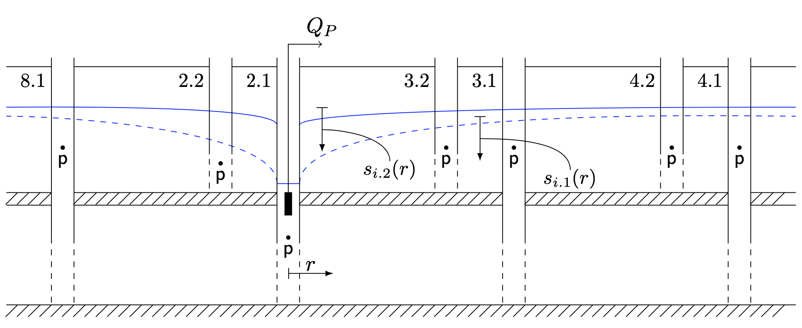

# Measurement of aquifer properties

The experiments presented here are done to derive aquifer parameters, thereby we go from very local measurements to regional parameter assessments.  
  
This documentation includes code to visualize the data which is a good starting point for further analysis. The code to produce the figures below can be viewed by clicking on the eye icon at the top of the site.  

## Flow meter test
The flowmeter data set was measured in borehole 6.1. The groundwater table was at 3.75m below the rim of the borehole. The screened section of the borehole is between 9.5m and 14.5m below the rim. The diameter of the borehole is 10.5cm.    
The flowmeter was moved at a constant speed of 7m/s for the experiments labeled 'Continuous measurement' or 'Continuous meas.' in Figure \@ref(fig:flowmeter-data-set1). In a second experiment, point measurements were taken at intervals of 50cm (labeled 'Point measurement' or 'Point meas.' in Figure \@ref(fig:flowmeter-data-set1)). The data for the task is available [here](https://github.com/mabesa/Documentation_GW_field_course_2020/tree/master/_bookdown_files/data/Experiments_aquifer_properties/flowmeter_task.csv).    
```{r flowmeter-data-set1, echo=FALSE, out.width='100%', fig.cap='Data set of the flow meter test in borehole 6.1. cont and point indicate continuous lowering & rising of the flow meter and point measurements at defined depths respectively under non-pumping conditions.'}
fl1 <- read.csv('_bookdown_files/data/Experiments_aquifer_properties/flowmeter1.csv',
                sep=';', row.names = NULL,
                col.names=c('ID','Time_ms','Depth_cm','FlowUP_Hz','FlowDN_Hz','N'))
fl1 <- fl1 %>%
  mutate(Flow_Hz=FlowUP_Hz-FlowDN_Hz) %>% 
  filter(ID!='test', ID!='windingspeed', ID!='wspeed2') 
fl1$ID[fl1$ID=='cont'] <- 'Continuous measurement'
fl1$ID[fl1$ID=='point'] <- 'Point measurement'
fl1$ID[fl1$ID=='pumpingcont'] <- 'Continuous meas. pumping'
fl1$ID[fl1$ID=='pumpingpoint'] <- 'Point meas. pumping'

write.table(fl1,'_bookdown_files/data/Experiments_aquifer_properties/flowmeter_task.csv',
            quote=FALSE,sep=',',row.names = FALSE,col.names=TRUE)
  
ggplot(fl1) + 
  geom_point(aes(Flow_Hz,Depth_cm/100,color=Time_ms), size=0.2) + 
  facet_wrap('ID') + 
  scale_y_continuous(trans = "reverse") + 
  geom_hline(yintercept=3.75,color='blue') +
  geom_hline(yintercept=9.5,color='gray') + 
  geom_hline(yintercept=14.5,color='gray') + 
  labs(x='Flow (>0:Up, <0:Down) [Hz]', y='Depth [m]', color='Time [ms]') + 
  theme_bw()
```

#### Task 10: Evaluate flow meter test {-}
Follow the steps in [@Molz1989] to determine flow velocities and hydaulic conductivities along the borehole. 

## Dilution test
Figure \@ref(fig:dilution-data-set1) shows the electrical conductivity and temperature measured during a dilution test in borehole 4.2. The water in the well was mixed using a small submersible pump. 150g of NaCl was dissolved in water and the solution injected continuously into the borehole within one turn-over time, i.e. the time it takes for the water in the well to circulate through the pumps pipes.
During the dilution tests, groundwater was continuously pumped from well 4.1 (for the tracer test). The data is available  [here](https://github.com/mabesa/Documentation_GW_field_course_2020/tree/master/_bookdown_files/data/Experiments_aquifer_properties/dilution2.CSV).

```{r dilution-data-set1, echo=FALSE, out.width='100%', fig.cap='Data set 1 of the dilution test in borehole 4.2.'}
dl2 <- read.csv('_bookdown_files/data/Experiments_aquifer_properties/dilution1.CSV',
                sep=';', dec=',',row.names = NULL, 
                colClasses = c('character','integer','integer','character',
                               'numeric','character','character','numeric',
                               'character','character','character','character',
                               'character','character','integer'))
dl2$Unit[dl2$Unit=='\xb5S/cm'] <- 'microS/cm'
dl2$Unit2[dl2$Unit2=='\xb0C'] <- 'degC'
dl2$Date.Time <- as.POSIXct(dl2$Date.Time, format='%d.%m.%Y %H:%M:%S', tz='CET')

dl2 %>%
  transmute(Date.Time = Date.Time, 
            `ElCond_microS/cm` = Value, 
            Temperature_degC = Value2) %>%
  pivot_longer(-Date.Time, names_to = 'Parameter', values_to = 'Value') %>%
  ggplot() + 
  geom_point(aes(Date.Time, Value), size=0.2) + 
  facet_wrap('Parameter', nrow=1, scale='free_y') +
  labs(x='', title='Data set 1, borehole 4.2') + 
  theme_bw()

```

Dilution test 2 was performed in borehole 3.2 (Figure \@ref(fig:dilution-data-set2)). Note, 2 dilution curves are in the input file. A solution of 90g of NaCl was added from a Mariotte's bottle to borehole 3.2 over the duration of 95 seconds. Use the second curve starting at 14:30! The data is available [here](https://github.com/mabesa/Documentation_GW_field_course_2020/tree/master/_bookdown_files/data/Experiments_aquifer_properties/dilution2.CSV).
```{r dilution-data-set2, echo=FALSE, out.width='100%', fig.cap='Data set 2 of the dilution test in borehole 3.2.'}
dl4 <- read.csv('_bookdown_files/data/Experiments_aquifer_properties/dilution2.CSV',
                sep=';', dec=',',row.names = NULL, 
                colClasses = c('character','integer','integer','character',
                               'numeric','character','character','numeric',
                               'character','character','character','character',
                               'character','character','integer'))
dl4$Unit[dl4$Unit=='\xb5S/cm'] <- 'microS/cm'
dl4$Unit2[dl4$Unit2=='\xb0C'] <- 'degC'
dl4$Date.Time <- as.POSIXct(dl4$Date.Time, format='%d.%m.%Y %H:%M:%S', tz='CET')

dl4 %>%
  transmute(Date.Time = Date.Time, 
            `ElCond_microS/cm` = Value, 
            Temperature_degC = Value2) %>%
  pivot_longer(-Date.Time, names_to = 'Parameter', values_to = 'Value') %>%
  filter(Date.Time > as.POSIXct("2019-06-05 14:30:00")) %>%
  ggplot() + 
  geom_point(aes(Date.Time, Value), size=0.2) + 
  facet_wrap('Parameter', nrow=1, scale='free_y') +
  labs(x='', title='Data set 2, borehole 3.2') + 
  theme_bw()
```

#### Task 11: Calculate Darcy velocities {-}
Estimate the Darcy velocities based on the two break-through curves following e.g. @Piccinini2016. 

## Slug test
Slug test data set 1 describes a slug test performed in borehole 3.1. Sensors measured pressure and temperature in boreholes 3.1 and 3.2. The volume of the cylindrical slug object is 0.013 m^3^. 6 slug tests were performed: 3 fast ones where the slug volume was lowered and pulled out again quickly and 3 slow ones where the slug volume was entered and pulled out over a time interval of approximately 7 seconds. The data from these 6 consecutive experiments is shown in Figure \@ref(fig:slugtest-data-set1). The data is available [here](https://github.com/mabesa/Documentation_GW_field_course_2020/tree/master/_bookdown_files/data/Experiments_aquifer_properties/slug1.csv).
```{r slugtest-data-set1, echo=FALSE, out.width='100%', fig.cap='Data set 1 of the slug test in borehole 3.2.'}
options(digits.secs=3) 
sl1 <- read.csv('_bookdown_files/data/Experiments_aquifer_properties/slug1.csv',
                sep=';', dec='.',row.names = NULL, skip=5, na.strings = '#NV', 
                colClasses = c('character','numeric','character','numeric',
                               'character','numeric','character','numeric'))
sl1$Time.SN.46121..S30X..P1 <- as.POSIXct(paste0('2019-06-05 ',
                                                 sl1$Time.SN.46121..S30X..P1),
                                          format='%Y-%m-%d %H:%M:%OS')
sl1$Time.SN.46121..S30X..TOB1 <- as.POSIXct(paste0('2019-06-05 ',
                                                   sl1$Time.SN.46121..S30X..TOB1),
                                            format='%Y-%m-%d %H:%M:%OS')
sl1$Time.SN.46133..S30X..P1 <- as.POSIXct(paste0('2019-06-05 ',
                                                 sl1$Time.SN.46133..S30X..P1),
                                          format='%Y-%m-%d %H:%M:%OS')
sl1$Time.SN.46133..S30X..TOB1 <- as.POSIXct(paste0('2019-06-05 ',
                                                   sl1$Time.SN.46133..S30X..TOB1),
                                            format='%Y-%m-%d %H:%M:%OS')
# Reformat data
sl1a <- sl1[,1:2] %>%
  transmute(Time = Time.SN.46121..S30X..P1, Value = SN.46121..S30X..P1.bar) %>%
  mutate(Parameter = 'Pressure', Unit = 'bar', 'Borehole' = '3.1') 
sl1b <- sl1[,3:4] %>%
  transmute(Time = Time.SN.46121..S30X..TOB1, Value = SN.46121..S30X..TOB1..C) %>%
  mutate(Parameter = 'Temperature', Unit = '°C', 'Borehole' = '3.1') 
sl1c <- sl1[,5:6] %>%
  transmute(Time = Time.SN.46133..S30X..P1, Value = SN.46133..S30X..P1.bar) %>%
  mutate(Parameter = 'Pressure', Unit = 'bar', 'Borehole' = '3.2') 
sl1d <- sl1[,7:8] %>%
  transmute(Time = Time.SN.46133..S30X..TOB1, Value = SN.46133..S30X..TOB1..C) %>%
  mutate(Parameter = 'Temperature', Unit = '°C', 'Borehole' = '3.2') 

sl1 <- full_join(sl1a,sl1b,by = c("Time", "Value", "Parameter", "Unit", "Borehole")) %>%
  full_join(., sl1c, by = c("Time", "Value", "Parameter", "Unit", "Borehole")) %>%
  full_join(., sl1d, by = c("Time", "Value", "Parameter", "Unit", "Borehole")) %>%
  drop_na(Time) %>% drop_na(Value) %>%
  arrange(.,Time)

rm(list=c('sl1a','sl1b','sl1c','sl1d'))

ggplot(sl1) + 
  geom_point(aes(Time, Value, color=Borehole), size=0.2) + 
  facet_wrap('Parameter', nrow=2, scale='free_y') +
  labs(x='Time [minutes since start]', y='Temperature [°C]               Pressure [bar]', 
       title='Data set 1, borehole 3.2') + 
  theme_bw() 
```

A second set of slug tests using the same slug object was performed in well 3.1 and observed in well 3.2 (Figure \@ref(fig:slugtest-data-set2)). The data is available [here](https://github.com/mabesa/Documentation_GW_field_course_2020/tree/master/_bookdown_files/data/Experiments_aquifer_properties/slug2.csv). 
```{r slugtest-data-set2, echo=FALSE, out.width='100%', fig.cap='Data set 2 of the slug test in borehole 3.1.'}
sl2 <- read.csv('_bookdown_files/data/Experiments_aquifer_properties/slug2.csv',
                sep=';', dec='.',row.names = NULL, skip=5, na.strings = '#NV', 
                colClasses = c('character','numeric','character','numeric',
                               'character','numeric','character','numeric'))
sl2$Time.SN.46121..S30X..P1 <- as.POSIXct(paste0('2019-06-05 ',
                                                 sl2$Time.SN.46121..S30X..P1),
                                          format='%Y-%m-%d %H:%M:%OS')
sl2$Time.SN.46121..S30X..TOB1 <- as.POSIXct(paste0('2019-06-05 ',
                                                   sl2$Time.SN.46121..S30X..TOB1),
                                            format='%Y-%m-%d %H:%M:%OS')
sl2$Time.SN.46133..S30X..P1 <- as.POSIXct(paste0('2019-06-05 ',
                                                 sl2$Time.SN.46133..S30X..P1),
                                          format='%Y-%m-%d %H:%M:%OS')
sl2$Time.SN.46133..S30X..TOB1 <- as.POSIXct(paste0('2019-06-05 ',
                                                   sl2$Time.SN.46133..S30X..TOB1),
                                            format='%Y-%m-%d %H:%M:%OS')
# Reformat data
sl2a <- sl2[,1:2] %>%
  transmute(Time = Time.SN.46133..S30X..P1, Value = SN.46133..S30X..P1.bar) %>%
  mutate(Parameter = 'Pressure', Unit = 'bar', 'Borehole' = '3.1') 
sl2b <- sl2[,3:4] %>%
  transmute(Time = Time.SN.46133..S30X..TOB1, Value = SN.46133..S30X..TOB1..C) %>%
  mutate(Parameter = 'Temperature', Unit = '°C', 'Borehole' = '3.1') 
sl2c <- sl2[,5:6] %>%
  transmute(Time = Time.SN.46121..S30X..P1, Value = SN.46121..S30X..P1.bar) %>%
  mutate(Parameter = 'Pressure', Unit = 'bar', 'Borehole' = '3.2') 
sl2d <- sl2[,7:8] %>%
  transmute(Time = Time.SN.46121..S30X..TOB1, Value = SN.46121..S30X..TOB1..C) %>%
  mutate(Parameter = 'Temperature', Unit = '°C', 'Borehole' = '3.2') 

sl2 <- full_join(sl2a,sl2b,by = c("Time", "Value", "Parameter", "Unit", "Borehole")) %>%
  full_join(., sl2c, by = c("Time", "Value", "Parameter", "Unit", "Borehole")) %>%
  full_join(., sl2d, by = c("Time", "Value", "Parameter", "Unit", "Borehole")) %>%
  drop_na(Time) %>% drop_na(Value) %>%
  arrange(.,Time)

rm(list=c('sl2a','sl2b','sl2c','sl2d'))

ggplot(sl2) + 
  geom_point(aes(Time, Value, color=Borehole), size=0.2) + 
  facet_wrap('Parameter', nrow=2, scale='free_y') +
  labs(x='Time [minutes since start]', y='Temperature [°C]               Pressure [bar]', 
       title='Data set 2, borehole 3.1') + 
  theme_bw() 
```

A third set of slug tests using the same slug object was performed in well 3.1 and observed in well 3.2 (Figure \@ref(fig:slugtest-data-set3)). The data is available [here](https://github.com/mabesa/Documentation_GW_field_course_2020/tree/master/_bookdown_files/data/Experiments_aquifer_properties/slug3.csv). 
```{r slugtest-data-set3, echo=FALSE, out.width='100%', fig.cap='Data set 3 of the slug test in borehole 3.1.'}
sl3 <- read.csv('_bookdown_files/data/Experiments_aquifer_properties/slug3.csv',
                sep=';', dec='.',row.names = NULL, skip=5, na.strings = '#NV', 
                colClasses = c('character','numeric','character','numeric',
                               'character','numeric','character','numeric'))
sl3$Time.SN.46121..S30X..P1 <- as.POSIXct(paste0('2019-06-05 ',
                                                 sl3$Time.SN.46121..S30X..P1),
                                          format='%Y-%m-%d %H:%M:%OS')
sl3$Time.SN.46121..S30X..TOB1 <- as.POSIXct(paste0('2019-06-05 ',
                                                   sl3$Time.SN.46121..S30X..TOB1),
                                            format='%Y-%m-%d %H:%M:%OS')
sl3$Time.SN.46133..S30X..P1 <- as.POSIXct(paste0('2019-06-05 ',
                                                 sl3$Time.SN.46133..S30X..P1),
                                          format='%Y-%m-%d %H:%M:%OS')
sl3$Time.SN.46133..S30X..TOB1 <- as.POSIXct(paste0('2019-06-05 ',
                                                   sl3$Time.SN.46133..S30X..TOB1),
                                            format='%Y-%m-%d %H:%M:%OS')
# Reformat data
sl3a <- sl3[,1:2] %>%
  transmute(Time = Time.SN.46133..S30X..P1, Value = SN.46133..S30X..P1.bar) %>%
  mutate(Parameter = 'Pressure', Unit = 'bar', 'Borehole' = '3.2') 
sl3b <- sl3[,3:4] %>%
  transmute(Time = Time.SN.46133..S30X..TOB1, Value = SN.46133..S30X..TOB1..C) %>%
  mutate(Parameter = 'Temperature', Unit = '°C', 'Borehole' = '3.2') 
sl3c <- sl3[,5:6] %>%
  transmute(Time = Time.SN.46121..S30X..P1, Value = SN.46121..S30X..P1.bar) %>%
  mutate(Parameter = 'Pressure', Unit = 'bar', 'Borehole' = '3.1') 
sl3d <- sl3[,7:8] %>%
  transmute(Time = Time.SN.46121..S30X..TOB1, Value = SN.46121..S30X..TOB1..C) %>%
  mutate(Parameter = 'Temperature', Unit = '°C', 'Borehole' = '3.1') 

sl3 <- full_join(sl3a,sl3b,by = c("Time", "Value", "Parameter", "Unit", "Borehole")) %>%
  full_join(., sl3c, by = c("Time", "Value", "Parameter", "Unit", "Borehole")) %>%
  full_join(., sl3d, by = c("Time", "Value", "Parameter", "Unit", "Borehole")) %>%
  drop_na(Time) %>% drop_na(Value) %>%
  arrange(.,Time)

rm(list=c('sl3a','sl3b','sl3c','sl3d'))

ggplot(sl3) + 
  geom_point(aes(Time, Value, color=Borehole), size=0.2) + 
  facet_wrap('Parameter', nrow=2, scale='free_y') +
  labs(x='Time [minutes since start]', y='Temperature [°C]               Pressure [bar]', 
       title='Data set 3, borehole 3.1') + 
  theme_bw() 
```

#### Task 12: Estimate S and K using Cooper's method {-}
Choose one of the 3 data sets and estimate aquifer storativity and hydraulic conductivity sing Cooper's method [@Kruseman2000].

#### Task 13: Estimate S and K using Butler's method {-}
Choose one of the 3 data sets and estimate aquifer storativity and hydraulic conductivity sing Butler's method [@Butler2003].

## Pumping test
Pressure was measured in boreholes 2.1, 2.2, 3.1, 3.2, 4.1, 4.2 and 8.1 with measurement intervals of 0.2s. Water was pumped from borehole 2.1 for 20 minutes and then turned off and recovery of the groundwater table was monitored for another 20 minutes. During the pumping test, groundwater was continuously pumped from well 4.1 for the tracer test experiment. Figure \@ref(fig:setup-pumping-test) shows an overview over the experimental setup.   

```{r setup-pumping-test, echo = FALSE, out.width='100%', fig.cap='Setup of the pumping tests during field course 2019. Drawing by Baume, Gardenghi, Formakova, Huber and Cracknell.'}

```

Since the times on the field laptops were not synchronized, the starting times of the pressure time series are not consistent. A spatial analysis of the pumping test thus cannot be done. The data presented in Figure \@ref(fig:pumping-test-pressure-signals) is available [here](https://github.com/mabesa/Documentation_GW_field_course_2020/tree/master/_bookdown_files/data/Experiments_aquifer_properties/pumping_test_task.csv). Alternatively, the raw pressure data for the pumping test can be downloaded [here](https://github.com/mabesa/Documentation_GW_field_course_2020/tree/master/_bookdown_files/data/Experiments_aquifer_properties) (all files starting with "pumping_test"). We recommend to use the code producing Figure \@ref(fig:pumping-test-pressure-signals) as a starting point for the tasks. The code can be viewed by clicking on the eye icon at the top of the page. 
```{r pumping-test-pressure-signals, echo=FALSE, message=FALSE, warning=FALSE, fig.cap='Pressure signals measured at 7 sites during the pumping test.'}
# Read in discharge of pump.
pQ <- read_xlsx('_bookdown_files/data/Experiments_aquifer_properties/pumping_test_Discharge_Pump.xlsx', 
                range='A4:C14')

# Read in pressure signals measured in the piezometers.
pB2 <- read.csv('_bookdown_files/data/Experiments_aquifer_properties/pumping_test_pressure_2.1_2.2.csv', 
                skip = 5, sep=';', na.strings = '#NV',
                colClasses = c('character','numeric','character','numeric',
                               'character','numeric','character','numeric'))
pB2 <- pB2 %>%
  select(-starts_with('X')) %>%
  drop_na()
colnames(pB2) <- c('Time-p2.2','p2.2_bar','Time-T2.2','T2.2_degC','Time-p2.1',
                  'p2.1_bar','Time-T2.1','T2.1_degC')

pB3 <- read.csv('_bookdown_files/data/Experiments_aquifer_properties/pumping_test_pressure_3.1_3.2.csv', 
                skip = 5, sep=';', na.strings = '#NV',
                colClasses = c('character','numeric','character','numeric',
                               'character','numeric','character','numeric'))
pB3 <- pB3 %>%
  select(-starts_with('X')) %>%
  drop_na()
colnames(pB3) <- c('Time-p3.1','p3.1_bar','Time-T3.1','T3.1_degC','Time-p3.2',
                  'p3.2_bar','Time-T3.2','T3.2_degC')

pB4 <- read.csv('_bookdown_files/data/Experiments_aquifer_properties/pumping_test_pressure_4.2_4.1.csv', 
                skip = 5, sep=';', na.strings = '#NV',
                colClasses = c('character','numeric','character','numeric',
                               'character','numeric','character','numeric'))
pB4 <- pB4 %>%
  select(-starts_with('X')) %>%
  drop_na()
colnames(pB4) <- c('Time-p4.1','p4.1_bar','Time-T4.1','T4.1_degC','Time-p4.2',
                  'p4.2_bar','Time-T4.2','T4.2_degC')

pB8 <- read.csv('_bookdown_files/data/Experiments_aquifer_properties/pumping_test_pressure_8_1.csv', 
                skip = 5, sep=';', na.strings = '#NV',
                colClasses = c('character','numeric','character','numeric'))
pB8 <- pB8 %>%
  select(-starts_with('X')) %>%
  drop_na()
colnames(pB8) <- c('Time-p8.1','p8.1_bar','Time-T8.1','T8.1_degC')

# Milliseconds need to be interpolated for the time series in boreholes 2.1 and 2.2 (approximative solution, error in time of approx. 0.05s). Further, times of lab computer were not synchronized. Need to add time difference to homogenize start times of the experiment but does not work out here. This means that we cannot put the drawdown curves in spatial relation to each other.  
time_start <- min(c(pB2$`Time-p2.2`,pB2$`Time-p2.1`,pB3$`Time-p3.1`,
                    pB3$`Time-p3.2`,pB4$`Time-p4.1`,pB4$`Time-p4.2`,
                    pB8$`Time-p8.1`))  # Assume all participants of the test started the computer at exactly the same time.
time_start <- as.POSIXct(time_start,format='%d.%m.%Y %H:%M:%OS')

pB2$`Time-p2.2` <- as.POSIXct(pB2$`Time-p2.2`,tryFormats=c('%d.%m.%Y %H:%M:%OS','%d.%m.%Y %H:%M'))
pB2$`Time-T2.2` <- as.POSIXct(pB2$`Time-T2.2`,tryFormats=c('%d.%m.%Y %H:%M:%OS','%d.%m.%Y %H:%M'))
pB2$`Time-p2.1` <- as.POSIXct(pB2$`Time-p2.1`,tryFormats=c('%d.%m.%Y %H:%M:%OS','%d.%m.%Y %H:%M'))
pB2$`Time-T2.1` <- as.POSIXct(pB2$`Time-T2.1`,tryFormats=c('%d.%m.%Y %H:%M:%OS','%d.%m.%Y %H:%M'))

pB2 <- pB2 %>%
  mutate(`Time-p2.2` = seq(as.POSIXct('05.06.2019 18:16:28.276',
                                      format='%d.%m.%Y %H:%M:%OS'), 
                           as.POSIXct('05.06.2019 18:59:05.638',
                                      format='%d.%m.%Y %H:%M:%OS'), 
                           length.out = length(`Time-p2.2`))-`Time-p2.2`[1],
         `Time-T2.2` = seq(as.POSIXct('05.06.2019 18:16:28.297',
                                       format='%d.%m.%Y %H:%M:%OS'), 
                            as.POSIXct('05.06.2019 18:59:05.638',
                                       format='%d.%m.%Y %H:%M:%OS'), 
                            length.out = length(`Time-T2.2`))-`Time-T2.2`[1],
         `Time-p2.1` = seq(as.POSIXct('05.06.2019 18:16:28.309',
                                      format='%d.%m.%Y %H:%M:%OS'), 
                           as.POSIXct('05.06.2019 18:59:05.638',
                                      format='%d.%m.%Y %H:%M:%OS'), 
                           length.out = length(`Time-p2.1`))-`Time-p2.1`[1],
         `Time-T2.1` = seq(as.POSIXct('05.06.2019 18:16:28.309',
                                      format='%d.%m.%Y %H:%M:%OS'), 
                           as.POSIXct('05.06.2019 18:59:05.638',
                                      format='%d.%m.%Y %H:%M:%OS'), 
                           length.out = length(`Time-T2.1`))-`Time-T2.1`[1])

pB3$`Time-p3.1` <- as.POSIXct(pB3$`Time-p3.1`,format='%d.%m.%Y %H:%M:%OS')
pB3$`Time-p3.1` <- pB3$`Time-p3.1`-(pB3$`Time-p3.1`[1])
pB3$`Time-T3.1` <- as.POSIXct(pB3$`Time-T3.1`,format='%d.%m.%Y %H:%M:%OS')
pB3$`Time-T3.1` <- pB3$`Time-T3.1`-(pB3$`Time-T3.1`[1])
pB3$`Time-p3.2` <- as.POSIXct(pB3$`Time-p3.2`,format='%d.%m.%Y %H:%M:%OS')
pB3$`Time-p3.2` <- pB3$`Time-p3.2`-(pB3$`Time-p3.2`[1])
pB3$`Time-T3.2` <- as.POSIXct(pB3$`Time-T3.2`,format='%d.%m.%Y %H:%M:%OS')
pB3$`Time-T3.2` <- pB3$`Time-T3.2`-(pB3$`Time-T3.2`[1])

pB4$`Time-p4.1` <- as.POSIXct(pB4$`Time-p4.1`,format='%d.%m.%Y %H:%M:%OS')
pB4$`Time-p4.1` <- pB4$`Time-p4.1`-(pB4$`Time-p4.1`[1])
pB4$`Time-T4.1` <- as.POSIXct(pB4$`Time-T4.1`,format='%d.%m.%Y %H:%M:%OS')
pB4$`Time-T4.1` <- pB4$`Time-T4.1`-(pB4$`Time-T4.1`[1])
pB4$`Time-p4.2` <- as.POSIXct(pB4$`Time-p4.2`,format='%d.%m.%Y %H:%M:%OS')
pB4$`Time-p4.2` <- pB4$`Time-p4.2`-(pB4$`Time-p4.2`[1])
pB4$`Time-T4.2` <- as.POSIXct(pB4$`Time-T4.2`,format='%d.%m.%Y %H:%M:%OS')
pB4$`Time-T4.2` <- pB4$`Time-T4.2`-(pB4$`Time-T4.2`[1])

pB8$`Time-p8.1` <- as.POSIXct(pB8$`Time-p8.1`,format='%d.%m.%Y %H:%M:%OS')
pB8$`Time-p8.1` <- pB8$`Time-p8.1`-(pB8$`Time-p8.1`[1])
pB8$`Time-T8.1` <- as.POSIXct(pB8$`Time-T8.1`,format='%d.%m.%Y %H:%M:%OS')
pB8$`Time-T8.1` <- pB8$`Time-T8.1`-(pB8$`Time-T8.1`[1])

# Concatenate all data in one data frame
pB2a <- pB2[,1:2] %>%
  transmute(Time = `Time-p2.2`, Value = `p2.2_bar`) %>%
  mutate(Parameter = 'Pressure', Unit = 'bar', 'Borehole' = '2.2',
         Diff = Value-Value[1]) 
pB2b <- pB2[,3:4] %>%
  transmute(Time = `Time-T2.2`, Value = `T2.2_degC`) %>%
  mutate(Parameter = 'Temperature', Unit = 'degC', 'Borehole' = '2.2',
         Diff = Value-Value[1]) 
pB2c <- pB2[,5:6] %>%
  transmute(Time = `Time-p2.1`, Value = `p2.1_bar`) %>%
  mutate(Parameter = 'Pressure', Unit = 'bar', 'Borehole' = '2.1',
         Diff = Value-Value[1]) 
pB2d <- pB2[,7:8] %>%
  transmute(Time = `Time-T2.1`, Value = `T2.1_degC`) %>%
  mutate(Parameter = 'Temperature', Unit = 'degC', 'Borehole' = '2.1',
         Diff = Value-Value[1]) 
pB3a <- pB3[,1:2] %>%
  transmute(Time = `Time-p3.1`, Value = `p3.1_bar`) %>%
  mutate(Parameter = 'Pressure', Unit = 'bar', 'Borehole' = '3.1',
         Diff = Value-Value[1]) 
pB3b <- pB3[,3:4] %>%
  transmute(Time = `Time-T3.1`, Value = `T3.1_degC`) %>%
  mutate(Parameter = 'Temperature', Unit = 'degC', 'Borehole' = '3.1',
         Diff = Value-Value[1]) 
pB3c <- pB3[,5:6] %>%
  transmute(Time = `Time-p3.2`, Value = `p3.2_bar`) %>%
  mutate(Parameter = 'Pressure', Unit = 'bar', 'Borehole' = '3.2',
         Diff = Value-Value[1]) 
pB3d <- pB3[,7:8] %>%
  transmute(Time = `Time-T3.2`, Value = `T3.2_degC`) %>%
  mutate(Parameter = 'Temperature', Unit = 'degC', 'Borehole' = '3.2',
         Diff = Value-Value[1]) 
pB4a <- pB4[,1:2] %>%
  transmute(Time = `Time-p4.1`, Value = `p4.1_bar`) %>%
  mutate(Parameter = 'Pressure', Unit = 'bar', 'Borehole' = '4.1',
         Diff = Value-Value[1]) 
pB4b <- pB4[,3:4] %>%
  transmute(Time = `Time-T4.1`, Value = `T4.1_degC`) %>%
  mutate(Parameter = 'Temperature', Unit = 'degC', 'Borehole' = '4.1',
         Diff = Value-Value[1]) 
pB4c <- pB4[,5:6] %>%
  transmute(Time = `Time-p4.2`, Value = `p4.2_bar`) %>%
  mutate(Parameter = 'Pressure', Unit = 'bar', 'Borehole' = '4.2',
         Diff = Value-Value[1]) 
pB4d <- pB4[,7:8] %>%
  transmute(Time = `Time-T4.2`, Value = `T4.2_degC`) %>%
  mutate(Parameter = 'Temperature', Unit = 'degC', 'Borehole' = '4.2',
         Diff = Value-Value[1]) 
pB8a <- pB8[,1:2] %>%
  transmute(Time = `Time-p8.1`, Value = `p8.1_bar`) %>%
  mutate(Parameter = 'Pressure', Unit = 'bar', 'Borehole' = '8.1',
         Diff = Value-Value[1]) 
pB8b <- pB8[,3:4] %>%
  transmute(Time = `Time-T8.1`, Value = `T8.1_degC`) %>%
  mutate(Parameter = 'Temperature', Unit = 'degC', 'Borehole' = '8.1',
         Diff = Value-Value[1]) 

pB <- full_join(pB2a,pB2b,by = c("Time","Value","Parameter","Unit","Borehole","Diff")) %>%
  full_join(., pB2c, by = c("Time","Value","Parameter","Unit","Borehole","Diff")) %>%
  full_join(., pB2d, by = c("Time","Value","Parameter","Unit","Borehole","Diff")) %>%
  full_join(., pB3a, by = c("Time","Value","Parameter","Unit","Borehole","Diff")) %>%
  full_join(., pB3b, by = c("Time","Value","Parameter","Unit","Borehole","Diff")) %>%
  full_join(., pB3c, by = c("Time","Value","Parameter","Unit","Borehole","Diff")) %>%
  full_join(., pB3d, by = c("Time","Value","Parameter","Unit","Borehole","Diff")) %>%
  full_join(., pB4a, by = c("Time","Value","Parameter","Unit","Borehole","Diff")) %>%
  full_join(., pB4b, by = c("Time","Value","Parameter","Unit","Borehole","Diff")) %>%
  full_join(., pB4c, by = c("Time","Value","Parameter","Unit","Borehole","Diff")) %>%
  full_join(., pB4d, by = c("Time","Value","Parameter","Unit","Borehole","Diff")) %>%
  full_join(., pB8a, by = c("Time","Value","Parameter","Unit","Borehole","Diff")) %>%
  full_join(., pB8b, by = c("Time","Value","Parameter","Unit","Borehole","Diff")) %>%
  drop_na(Time) %>% drop_na(Value) %>%
  arrange(.,Time)
rm(list=c('pB2','pB2a','pB2b','pB2c','pB2d','pB3','pB3a','pB3b','pB3c','pB3d',
          'pB4','pB4a','pB4b','pB4c','pB4d','pB8','pB8a','pB8b'))

pB %>% 
  transmute(Time_seconds_since_start = Time,
            Value = Value,
            Parameter = Parameter,
            Unit = Unit,
            Borehole = Borehole,
            ValueDifference_lag1 = Diff) %>%
  write.table(.,'_bookdown_files/data/Experiments_aquifer_properties/pumping_test_task.csv',
              quote=FALSE,sep=',',row.names = FALSE,col.names=TRUE)

pB %>%
  filter(Parameter=='Pressure') %>%
ggplot() + 
  geom_point(aes(Time/60,Diff),size=0.1) +
  facet_wrap('Borehole', scales = 'free_y')+
  labs(y='Pressure change [bar]',x='Time [minutes since start]')+
  theme_bw()
```

#### Task 14: Derive aquifer parameters {-}
Estimate the aquifer parameters based on the methods by Jacob and Walton described in @Kruseman2000 and discuss if the aquifer is confined or unconfined in the surroundings of borehole 2.1 and if steady state conditions were reached during the pumping test.


## Tracer test
The tracer tests was started on June 4th at 7p.m.. 100g of uranine tracer were diluted in 1000l of water and pumped to borehole 1.1. A pump in borehole 4.1 was running at a constant rate of 0.0052 m^3^/s for 3 days and uranine concentrations were sampled continuously (every 10 seconds) using a GGUN-FL Fluorometer [@Schnegg1997] (Figure \@ref(fig:tracer-breakthrough-sampler)) and manually at a 2-3 hours interval (Figure \@ref(fig:tracer-breakthrough-manual)). The data measured by the Fluorometer is available [here](https://github.com/mabesa/Documentation_GW_field_course_2020/blob/master/_bookdown_files/data/Experiments_aquifer_properties/tracer_automatic.mv) and the calibrated concentrations from the manual uranine samples are available [here](https://github.com/mabesa/Documentation_GW_field_course_2020/blob/master/_bookdown_files/data/Experiments_aquifer_properties/tracer_manual_calibration.xlsx).

```{r tracer-breakthrough-sampler, echo = FALSE, out.width='80%',fig.cap='Tracer signal in measured by the GGUN-FL Fluorometer. The turbidity signal is given in cyan color.'}
# Read in automatic measurements
tta <- read.table('_bookdown_files/data/Experiments_aquifer_properties/tracer_automatic.mv',
                  skip=3, sep='', strip.white = TRUE,
                  colClasses = c('numeric','character','numeric','numeric',
                                 'numeric','numeric','numeric','numeric',
                                 'numeric'),
                  header=FALSE)
colnames(tta) <- c('Index','Date','R','Tracer1','Tracer2','Tracer3',
                           'Turbidity','Baseline','BatteryVoltage',
                           'Temperature','Conductivity')
tta$Date <- as.POSIXct(tta$Date, format='%y/%m/%d-%H:%M:%S')

ggplot(tta %>% pivot_longer(contains('Tracer'),names_to='Tracer',values_to='Values')) + 
  geom_point(aes(Date,Values,color=Tracer),size=0.2) + 
  geom_point(aes(Date,Turbidity),data=tta,color='cyan',size=0.1) +
  theme_bw() + 
  labs(x='',y='Signal [mV]')
```


```{r tracer-breakthrough-manual, echo = FALSE, out.width='80%',fig.cap='Manually measured uranine breakthrough curve at well 4.1.'}
# Read in manual measurements (1ppb is equivalent to 1 micro g/L)
ttm <- read_xlsx('_bookdown_files/data/Experiments_aquifer_properties/tracer_manual_calibration.xlsx', 
                range='D5:F26', 
                col_names = c('Date','ParticleCount','Concentration_ppb'))

ggplot(ttm) + 
  geom_point(aes(Date,Concentration_ppb)) + 
  theme_bw() + 
  labs(x='',y='Concentration [ppb]')
```

#### Task 15: Calibrate the fluorometer data {-}
Calibrate the fluorometer data using the calibration data provided on [github](https://github.com/mabesa/Documentation_GW_field_course_2020/tree/master/_bookdown_files/data/Experiments_aquifer_properties/tracer_manual_calibration.xlsx) and compare the two breakthrough curves. Use the fluorometer data labeled 'Tracer 1'.     

#### Task 16: Simulate the tracer test usind FeFlow {-}
__Task description by Andres?__

