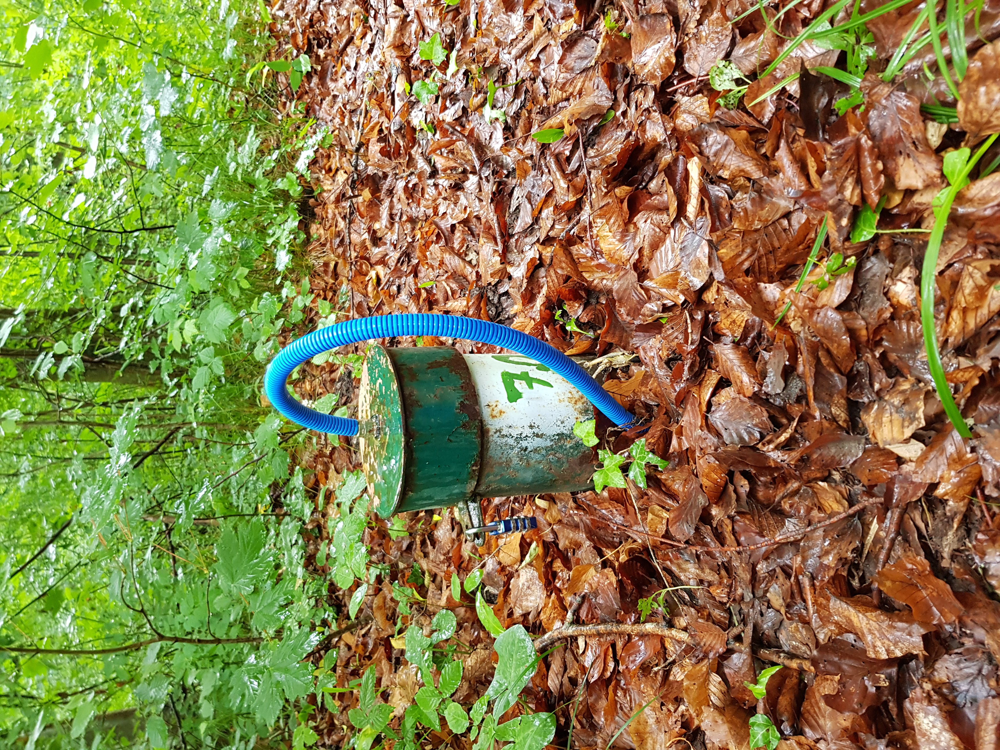

--- 
title: "Documentation for the groundwater field course"
cover-image: "_bookdown_files/figure_html/title.jpg"
author: "GW field course team"
date: "`r Sys.Date()`"
site: bookdown::bookdown_site
output: bookdown::gitbook
documentclass: book
bibliography: [book.bib, packages.bib]
biblio-style: apalike
link-citations: yes
github-repo: mabesa/Documentation_GW_field_course_2020
description: "Documentation for the groundwater field course 2020."
---

# {-}
```{r, echo=FALSE}

```

```{r include=FALSE}
# automatically create a bib database for R packages
knitr::write_bib(c(
  .packages(), 'bookdown', 'knitr', 'rmarkdown'
), 'packages.bib')
```
